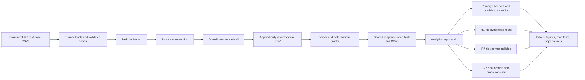

# CalibRead Testing Code Logic and H Interpretation Guide

## Document purpose

This document explains what the CalibRead testing and analytics code actually does, why each operation exists, how R1–R7 are represented, how the hallucination quantity \(H\) is computed, and which scientific conclusions are justified by each output.

It is both:

- a technical description of the implementation; and
- an interpretation manual for converting CSV rows and figures into defensible research claims.

The most important principle is:

> CalibRead does not simulate a desired hallucination curve or manufacture a value of \(H\). It experimentally realizes controlled query conditions, records the model's responses, grades those responses against frozen world specifications, and then estimates \(H\) from the observed false commits.

The test cases define the experimental conditions. The model produces the behavior. The grader converts that behavior into auditable event indicators. The analytics package estimates curves, uncertainty, calibration quality, policy performance, and conformal coverage.

---

## 1. The complete computation path



For a final query, the execution path is:

1. Load a frozen test-case row.
2. Derive its final-answer task and any required auxiliary task.
3. Construct a strict JSON-output prompt.
4. Send the request to the selected OpenRouter model with the frozen decoding configuration.
5. Save the provider response before attempting to interpret it.
6. Parse the response into an action, answer, confidence, and metadata.
7. Grade factual correctness and action correctness independently.
8. Determine whether the response is a correct operational commit.
9. Save the scored row and its links to component or clarification tasks.
10. Aggregate only eligible rows into primary estimands.

This separation is important. A provider request can succeed while parsing fails. Parsing can succeed while the action is wrong. An answer can be factually correct but still be an invalid operational commit, such as answering one arbitrary interpretation of an ambiguous query that should have triggered clarification.

---

## 2. Package and module responsibilities

### 2.1 Test execution package

The `calibread_openrouter` package is responsible for experimental execution and deterministic scoring. Its major logical responsibilities are:

| Responsibility | What it does | Why it is separate |
|---|---|---|
| Configuration | Loads API, model, decoding, retry, seed, path, and sampling settings | Makes each run reconstructable |
| Test-case validation | Checks required fields, levels, expected actions, world identities, and suite-specific structure | Prevents malformed cases from reaching the provider |
| Task derivation | Converts one case into final, component, or clarification-turn tasks | Supports R4 and R5 without conflating auxiliary probes with final queries |
| Prompt construction | Creates the system/user messages and output contract | Keeps request semantics stable across models |
| OpenRouter client | Submits calls, handles errors/retries, and records provider metadata | Isolates network behavior from experimental logic |
| Parsing | Converts returned text into the expected response schema | Makes malformed outputs visible rather than silently repairing them |
| Grading | Applies expected-answer and expected-action rules | Ensures model-independent, reproducible labels |
| Persistence | Writes raw and scored CSVs plus manifests and link tables | Preserves an audit trail and supports safe resumption |

### 2.2 Analytics package

The `calibread_analytics` package consumes the scored outputs. It is responsible for:

| Responsibility | Main output |
|---|---|
| Input audit | Schema, split, model, role, row-count, and leakage checks |
| Complexity curves | \(H\), accuracy, coverage, and intervals by R dimension and level |
| Confidence diagnostics | Brier score, log loss, ECE, MCE, AUROC, average precision, and risk-coverage curves |
| Hypothesis analysis | Frozen H1–H5 test results and uncertainty |
| Risk policies | Global and profile-aware threshold policies with error upper bounds |
| CPR | Calibration quantiles, prediction sets, coverage, and set size |
| Paper assets | CSV tables, plots, statistical summaries, and an analysis manifest |

The analytics package must never modify a model response or re-query a provider. Its inputs are frozen scored records.

---

## 3. Experimental unit, world, query, and task

These terms must not be used interchangeably.

### 3.1 World

A world is a synthetic or controlled factual state from which one or more queries are derived. Its identifier is `world_id`.

A world can contain:

- the canonical current value;
- past and updated values;
- relation chains;
- duplicated evidence exposures;
- distractors;
- alternative interpretations;
- domain-specific surface forms; and
- a frozen reference date.

World-level clustering is used because multiple rows derived from one world are statistically dependent.

### 3.2 Incoming query

An incoming query is one opportunity for the system to make a decision for a user. It is the denominator unit for the primary false-commit rate. A query remains in the denominator even when the model abstains or asks for clarification.

### 3.3 Task

A task is one provider interaction. Most incoming queries have a final task. Some have auxiliary tasks:

- R4 can have a clarification follow-up task.
- R5 can have direct component probes.
- stochastic confidence estimation can create repeated samples of the same task.

Auxiliary tasks do not become extra incoming final queries. The link tables preserve the many-task-to-one-query relationship.

### 3.4 Response sample

A response sample is one generated completion for one task under one sampling seed and decoding configuration. The greedy sample is the primary answer response. Stochastic samples estimate self-consistency or candidate distributions; they are not counted as separate user queries.

---

## 4. The response contract

The runner asks the model for a structured response containing, at minimum:

- an action;
- an answer field when applicable;
- a confidence or probability field when requested;
- optional explanatory metadata; and
- a parseable JSON structure.

The action vocabulary separates at least:

- `ANSWER`: commit to an answer;
- `ABSTAIN`: decline because the answer is unavailable or unsafe to infer; and
- `CLARIFY`: request the missing disambiguating information.

The exact action matters. A correct-looking string is not automatically a valid decision. For example:

- On an answerable unambiguous query, `ANSWER` with the canonical value can be a correct commit.
- On a post-cutoff unknown query, the expected action is `ABSTAIN`.
- On an underspecified multi-interpretation R4 query, the expected action is `CLARIFY`.

Strict parsing is a deliberate part of the benchmark. If a system is intended to provide machine-usable reliability contracts, invalid structure is an operational failure, not merely a formatting inconvenience.

---

## 5. The event indicators used by the grader

The grader separates several concepts that are often incorrectly collapsed into one accuracy score.

### 5.1 `parser_ok`

`parser_ok = 1` only when the response satisfies the required machine-readable contract.

A parse failure remains auditable. It is not silently converted to a correct response, and it cannot be a correct operational commit.

### 5.2 `action`

The parsed decision action: answer, abstain, or clarify.

### 5.3 `factual_correct`

For an attempted answer, this indicates whether the normalized answer matches the frozen reference answer under the case's grading rule.

The comparison can involve:

- canonicalized categorical strings;
- normalized dates;
- exact integers;
- fixed-decimal numeric strings;
- aliases explicitly allowed in the test specification; or
- case-specific structured comparison.

Numeric precision is part of R2. A value that is close but violates the required representation is not automatically treated as exact.

### 5.4 `operationally_unique`

This indicates whether the incoming query supports one operationally valid answer without clarification.

For R4 cases with multiple plausible interpretations, `operationally_unique = 0` on the first turn. Even if the model happens to choose a factually valid answer for one interpretation, it has not made a valid operational commit because the user's intended interpretation was not determined.

### 5.5 `answer_attempted`

Conceptually:

\[
\text{answer\_attempted}
=
\mathbb{1}\{\text{action} = \texttt{ANSWER}\}
\lor
\mathbb{1}\{\text{a nonempty normalized answer was emitted}\}.
\]

The second term prevents a malformed or semantically inconsistent output from escaping the commit accounting. If a response labels itself `ABSTAIN` but emits a concrete answer that downstream software could use, it is treated as an attempted commit.

### 5.6 `commit_correct`

The central operational correctness indicator is:

\[
\text{commit\_correct}
=
\mathbb{1}\{\text{parser\_ok}\}
\mathbb{1}\{\text{action}=\texttt{ANSWER}\}
\mathbb{1}\{\text{factual\_correct}\}
\mathbb{1}\{\text{operationally\_unique}\}.
\]

This is stricter than factual correctness alone.

### 5.7 `false_commit_loss`

The row-level loss underlying the primary \(H\) estimate is:

\[
L_i^{\mathrm{FC}}
=
\mathbb{1}\{\text{answer\_attempted}_i=1\}
\mathbb{1}\{\text{commit\_correct}_i=0\}.
\]

Equivalently in words: the system emitted an answer-like commitment, and that commitment was not an operationally correct answer.

This includes:

- factually wrong answers;
- answers to questions whose correct action was abstention;
- premature answers to ambiguous R4 questions;
- malformed answer-bearing responses; and
- other answer attempts that fail the frozen commit criteria.

It does not count a clean abstention or clarification as a false commit. Those behaviors reduce answer coverage and are reported separately.

---

## 6. The primary hallucination quantity H

### 6.1 Formal definition

Let \(Q\) be the incoming-query distribution, \(\theta\) the realized complexity condition, \(Y^*\) the frozen reference state, and \(D\) the system decision. Define an effective commitment indicator \(C(D)\), which is one when the system has emitted an answer-like commitment. Let \(D_{\mathrm{eff}}\) be the effective normalized answer when such a commitment exists.

The primary CalibRead hallucination/false-commit risk is:

\[
H(\theta,Q)
=
\Pr_{q\sim Q}
\left[
C(D(q))=1
\land
D_{\mathrm{eff}}(q)\not\equiv Y^*(q)
\mid \theta
\right].
\]

For finite test rows in condition \(\theta\):

\[
\widehat H(\theta)
=
\frac{1}{n_\theta}
\sum_{i=1}^{n_\theta}
L_i^{\mathrm{FC}}.
\]

The denominator is every eligible incoming query in the condition, not only answered queries.

### 6.2 Why the incoming-query denominator matters

Suppose a system receives 1,000 queries:

- it attempts answers on 800;
- 680 of those are correct commits;
- 120 are false commits; and
- it abstains or clarifies on 200.

Then:

\[
\widehat H = 120/1000 = 0.12.
\]

The conditional error among attempted answers is:

\[
\widehat H_{\mathrm{selective}} = 120/800 = 0.15.
\]

Answer coverage is:

\[
\widehat{\mathrm{coverage}} = 800/1000 = 0.80.
\]

All three numbers are needed. Reporting only 12% hides the quality of emitted answers; reporting only 15% hides how often the system refuses to answer; reporting only 80% says nothing about correctness.

### 6.3 Companion estimands

The analytics package reports companion quantities such as:

| Quantity | Meaning | Typical denominator |
|---|---|---|
| \(H\) or false-commit rate | Probability that an incoming query receives an invalid answer-like commit | All eligible incoming queries |
| Selective false-commit rate | Error among answer attempts | Answer-attempted queries |
| Answer coverage | Fraction receiving an answer attempt | All eligible incoming queries |
| Factual accuracy | Reference-match frequency under the stated eligibility rule | Explicitly reported population |
| Action accuracy | Whether answer/abstain/clarify was the expected action | All eligible incoming queries |
| Commit accuracy | Operationally correct answer commits | All eligible incoming queries |

Never label the selective error rate as the primary \(H\). Never report reduced \(H\) without coverage when abstention is allowed.

### 6.4 R4 worked example

Assume an R4 query has three valid interpretations but does not specify which one the user means.

- The model answers the value for interpretation 1.
- That value is factually correct for interpretation 1.
- The expected first-turn action is `CLARIFY`.
- `operationally_unique = 0`.
- `answer_attempted = 1`.
- `commit_correct = 0`.
- `false_commit_loss = 1`.

This is not a claim that the stated fact is false. It is a claim that the system made an unjustified operational commitment under ambiguity.

### 6.5 What the code does not claim

The code does not show that one scalar is an intrinsic, permanent property of a model. It estimates risk on a defined model, provider, decoding configuration, time window, benchmark population, complexity condition, and grading contract.

Therefore the defensible notation is \(H(\theta,Q)\), not an unqualified “the hallucination rate of model X.”

---

## 7. How R1–R7 realize the complexity coordinates

The benchmark controls query conditions by constructing frozen worlds and query variants. R1–R6 are experimental complexity dimensions. R7 is a deployment-policy/evaluation profile layer and must not be described as a seventh causal query factor.

### 7.1 R1 — Evidence exposure or redundancy

Representative controlled levels are:

\[
x \in \{0,1,2,4,8,16,32\}.
\]

The same target fact is exposed \(x\) times in the controlled context or world representation.

- At \(x=0\), the answer is deliberately not provided; the expected behavior is abstention under the benchmark contract.
- At \(x>0\), the fact is provided with controlled repetition, and the expected behavior is to answer the canonical value.

R1 measures whether reliability changes monotonically or saturates with greater evidence exposure. It does not establish how many times a fact appeared in a proprietary model's training corpus. The treatment is the benchmark's controlled exposure variable.

Primary outcomes by level include \(H\), commit accuracy, action accuracy, and answer coverage.

### 7.2 R2 — Required output precision

The levels increase representational specificity, for example:

- categorical;
- year;
- month and year;
- exact date;
- integer;
- one decimal place;
- three decimal places; and
- five decimal places.

Paired worlds keep the underlying target relation fixed while changing the required precision or answer representation. This makes the precision contrast more interpretable than comparing unrelated questions.

R2 is graded using the declared format and tolerance contract. If a case requires exactly three decimals, an otherwise numerically close response can fail the exact-format grading rule. Any supplementary tolerance-based result must be labeled as a sensitivity analysis, not silently substituted for the primary rule.

### 7.3 R3 — Temporal status

The primary T2 design represents multiple knowledge states, including:

- `stable_pre_cutoff`: a fact that remains stable;
- `superseded_stale`: an old value explicitly replaced by a newer value;
- `current_after_update`: the updated current value; and
- `post_cutoff_unknown`: information unavailable under the stated knowledge boundary and therefore requiring abstention.

The primary R3 comparison includes these states under a common controlled T2 protocol.

A secondary T0 diagnostic probes current real-world facts. It is not mixed into the primary H1–H5 confirmatory cells because it may be affected by provider updates, model refreshes, retrieval, and execution date. T0 results should be labeled diagnostic and date-stamped.

R3 distinguishes several failure modes:

- stale-value persistence;
- failure to update to a supplied current value;
- overclaiming post-cutoff knowledge; and
- unnecessary abstention on stable facts.

### 7.4 R4 — Ambiguity and clarification

The controlled level is the number of plausible interpretations, typically one through four.

- At one interpretation, the final question is operationally unique and can be answered.
- At more than one interpretation, the first-turn expected action is clarification.
- The runner can issue a second turn containing the selected interpretation, after which an answer becomes appropriate.

R4 therefore tests both first-turn restraint and post-clarification recovery.

Useful R4 outcomes include:

- premature answer rate on ambiguous first turns;
- correct clarification rate;
- clarification follow-up completion rate;
- final commit accuracy after clarification; and
- end-to-end false-commit risk.

The number of turns must not be confused with the number of incoming final queries. The link table joins clarification tasks back to their original query.

### 7.5 R5 — Compositional or multi-hop reasoning

The controlled levels increase the required relation-chain length, typically one through five hops.

For each final chain question, the runner can generate direct component probes for each required edge or atomic fact. Duplicate component probes are removed so that the same component is not overweighted.

This supports two different questions:

1. Does final-query reliability degrade with hop count?
2. When every component is answered correctly, does a residual composition failure remain?

The second question is central to H2. The code links final rows to component rows and conditions on all required components being correct commits. Component correctness does not make final correctness inevitable; it creates the subset in which residual composition error is measurable.

### 7.6 R6 — Domain shift

Parallel templates are instantiated across domain labels such as:

- general knowledge;
- biomedical;
- legal; and
- technical.

The intended control is the reasoning/template structure while domain vocabulary and content vary. The analysis checks whether complexity effects transfer uniformly across domains or whether specific domains have higher false-commit risk or poorer calibration.

Domain results are benchmark-domain results. They are not evidence of clinical or legal fitness for real deployment, and they do not replace expert validation.

### 7.7 R7 — Risk-profile and decision-policy layer

R7 represents policy profiles such as:

- easy or known;
- low-frequency;
- high-precision;
- stale or unknown;
- multi-hop; and
- a predicted profile assigned from query-visible features.

R7 is evaluated post hoc using scores and thresholds. It asks whether a deployment policy can trade coverage for bounded false-commit risk and whether query-profile-aware thresholds improve utility over one global threshold.

It must be described as a policy/evaluation layer, not as an independently randomized seventh causal input dimension. The model was not necessarily called again under every R7 threshold; the same frozen response scores can be evaluated under multiple selective policies.

---

## 8. Task construction and sampling logic

### 8.1 Final tasks

Every primary test case produces one final task. The final-task row carries:

- suite and level;
- split;
- world and query identifiers;
- analysis role;
- expected answer;
- expected action;
- grading rule; and
- frozen complexity metadata.

### 8.2 Component tasks

R5 component tasks directly ask for atomic relations needed by the final chain. They are stored and scored separately. A link table records which component tasks are required by each final query.

### 8.3 Clarification tasks

R4 first-turn tasks test whether the model requests clarification. The runner
also supplies every frozen disambiguating choice after any available first-turn
response. Therefore it reports two different quantities:
forced_clarification_recovery (second-turn capability regardless of first
action) and end_to_end_clarification_success (a valid first-turn CLARIFY plus a
correct second turn). The first must never be described as observed interactive
success.

### 8.4 Greedy and stochastic responses

The sample plan can contain:

- one greedy response for the primary answer;
- multiple stochastic responses for agreement, entropy, and candidate construction; and
- repeated identical-condition responses for nondeterminism analysis.

These samples serve different purposes. The greedy response is the main decision row. Stochastic responses estimate a distribution over answer clusters. Repeats measure execution variability. They must not be pooled as independent incoming queries.

### 8.5 PTrue

When enabled, a PTrue-style task asks the model to estimate the probability that its proposed answer is true. This is a model-reported score, not a proof of correctness. Its quality is evaluated using calibration and ranking metrics.

### 8.6 Resume behavior

The runner derives stable identities from the content-addressed scientific
bundle, task, sample kind, and sample index. A resumed run skips already
completed identities and appends missing ones only after every existing row is
verified against that bundle. Changing a model route, prompt, seed plan,
checkpoint manifest, grader/source, schema, profile rule, or testcase byte
causes fail-closed resume refusal and requires a new run directory.

---

## 9. Provider and decoding controls

The saved configuration should identify:

- exact OpenRouter model slug;
- provider or routing policy when fixed;
- temperature;
- top-p or other sampling controls;
- maximum output tokens;
- seed, when honored;
- prompt/schema version;
- request time;
- runner version or git commit;
- retry policy; and
- response/sample role.

A nominal seed does not guarantee byte-identical inference. Provider routing, batching, numerical kernels, model revisions, quantization, and backend changes can introduce nondeterminism. This is why the study records response-level metadata and includes repeated requests.

Repeated disagreement is a measured property of the deployed inference path under the recorded conditions. It should not automatically be attributed to one hidden cause unless the provider exposes sufficient evidence.

---

## 10. Parsing and answer normalization

### 10.1 Strict first, diagnostic second

The primary parser applies the declared JSON contract. Any lenient salvage parser, if used for diagnostics, must write separate fields and must not replace the primary parse outcome.

### 10.2 String normalization

String normalization can include operations declared by the benchmark, such as:

- trimming surrounding whitespace;
- Unicode normalization;
- case normalization where case is irrelevant;
- removal of explicitly permitted punctuation; and
- mapping frozen aliases to one canonical form.

Normalization must not introduce new semantic aliases after inspecting test results.

### 10.3 Numeric grading

Numeric cases use the case's declared representation. Primary exactness can include:

- integer equality;
- exact decimal-place formatting;
- normalized date equality; and
- explicitly frozen tolerance rules where appropriate.

Any relaxed tolerance analysis is reported separately.

### 10.4 Abstain and clarify grading

When the expected action is abstention or clarification, a concrete answer is not counted correct merely because it matches some available value. The action contract is part of correctness.

---

## 11. Confidence signals computed by the code

The code can derive several confidence signals. They answer different questions and need not agree.

### 11.1 Exact agreement with the greedy response

Let the greedy parsed-response cluster be \(a_g\), and let \(M\) be the total number of generation samples used for uncertainty estimation: the one greedy response plus its stochastic samples. The cluster key is `ANSWER|<normalized answer>` for an answer and the action/status cluster for abstain, clarify, or malformed output. Exact agreement is:

\[
s_{\mathrm{agree}}
=
\frac{1}{M}
\sum_{m=1}^M \mathbb{1}\{a_m=a_g\}.
\]

The sum includes the greedy sample itself. The reference is the greedy response, not the modal stochastic answer. This distinction matters when the stochastic mode differs from the deployed greedy answer.

High agreement means the sampling procedure reproduces the greedy answer often. It does not prove the answer is correct.

### 11.2 Exact parsed-answer/action entropy

If \(p_k\) is the empirical frequency of parsed-response cluster \(k\), including answer and non-answer action clusters, then:

\[
\mathcal H_{\mathrm{sample}}
=
-\sum_k p_k\log p_k.
\]

Higher entropy indicates more diverse exact normalized answers/actions. This is
exact_answer_entropy, not semantic entropy: paraphrases are not merged by an
NLI or embedding model. Entropy depends on the strict normalization and
decoding settings.

### 11.3 Greedy answer-token negative log-likelihood

When token log probabilities are available, the code summarizes the negative log-likelihood of the answer-bearing tokens of the greedy response. A distinct full-response NLL can also be retained.

Answer-token NLL is preferable for answer confidence because boilerplate JSON tokens can dominate a full-response average. Availability depends on the provider/model path.

### 11.4 PTrue score

The PTrue score is a separately elicited probability-like judgment about the proposed answer. It is evaluated empirically and should not be described as calibrated unless the held-out calibration analysis supports that statement.

### 11.5 Frozen primary confidence score

Protocol v1.2 uses exact agreement as the sole primary confidence score.
P(True) and token probability are optional, availability-labelled secondary
diagnostics. A missing declared score stays missing and cannot fall back to or
mix with another method. Every score is oriented so larger means more
confidence before any separate diagnostic comparison.

Never mix a high-is-good score and a low-is-good score without an explicit transformation.

---

## 12. Confidence-quality analytics

Let \(c_i\in[0,1]\) be a predicted correctness probability and \(z_i=\text{commit\_correct}_i\).

### 12.1 Brier score

\[
\mathrm{Brier}
=
\frac{1}{n}\sum_i(c_i-z_i)^2.
\]

Lower is better. It measures squared probability error and reflects both calibration and discrimination.

### 12.2 Log loss

\[
\mathrm{LogLoss}
=
-\frac{1}{n}\sum_i
\left[z_i\log c_i+(1-z_i)\log(1-c_i)\right],
\]

with numerical clipping at frozen limits. Lower is better and confidently wrong predictions receive a large penalty.

### 12.3 Expected calibration error

For bins \(B_b\):

\[
\mathrm{ECE}
=
\sum_b \frac{|B_b|}{n}
\left|
\operatorname{acc}(B_b)-\operatorname{conf}(B_b)
\right|.
\]

ECE is bin-dependent. The binning scheme must be frozen and reported.

### 12.4 Maximum calibration error

MCE is the largest absolute bin gap. It is sensitive to sparse bins and should be interpreted with bin counts.

### 12.5 AUROC and average precision

These assess ranking rather than probability calibration. A score can have high AUROC and poor ECE, or vice versa.

### 12.6 Risk-coverage and AURC

Sort queries by confidence and retain progressively larger accepted subsets. Plot selective risk against coverage. The area under this curve summarizes the quality of the confidence ranking for selective prediction. Lower risk at a given coverage is better.

No one metric establishes calibrated confidence by itself.

---

## 13. Aggregation and uncertainty

### 13.1 Primary eligible rows

Primary H curves use final test rows marked with the primary analysis role. They exclude auxiliary component tasks, stochastic replicas as separate queries, calibration rows, and secondary T0 diagnostic rows unless an analysis explicitly requests them.

### 13.2 World-cluster uncertainty

Rows from the same world can share facts, templates, or paired variants. Treating them as independent underestimates uncertainty. The code therefore resamples or clusters using a stable world cluster such as:

```text
run_id | world_id
```

Confidence intervals and bootstrap analyses preserve within-world dependence.

### 13.3 Equal-suite and equal-level summaries

A naïve pooled average is affected by how many rows were generated for each suite and level. When the target summary is “performance over complexity dimensions,” the analytics package can weight suites equally and levels equally within suite.

This answers a different question from an empirical-frequency-weighted deployment average. The weighting rule must be named in the table caption.

### 13.4 Multiple comparisons

The confirmatory H1–H5 analyses use their frozen tests and corrections. Additional model, level, domain, score, and metric exploration is labeled exploratory and, where formal p-values are shown, includes a stated multiplicity procedure.

---

## 14. Risk-control policy logic

### 14.1 Policy decision

For a score \(s_i\), adjustment \(g_i\), and threshold \(\tau\), a typical policy selects an answer only when:

\[
\pi_i(\tau)
=
\mathbb{1}\{\text{answer\_attempted}_i=1\}
\mathbb{1}\{s_i-g_i\ge\tau\}.
\]

The exact score orientation and adjustment come from the frozen configuration.

If the policy does not select the answer, the deployed action is abstention. Policy false-commit risk remains defined over incoming queries:

\[
R_{\mathrm{FC}}(\pi)
=
\frac{1}{n}\sum_i
\pi_i L_i^{\mathrm{FC}}.
\]

Policy coverage is:

\[
\mathrm{Coverage}(\pi)
=
\frac{1}{n}\sum_i\pi_i.
\]

### 14.2 Calibration-set threshold selection

Thresholds are chosen using calibration data only. The implementation evaluates a finite set of candidate thresholds and selects the highest-coverage candidate whose frozen risk upper bound is at or below the target \(\alpha\).

Depending on the scope, the upper bound is based on an exact binomial calculation or a declared weighted concentration bound. The selected threshold is then applied unchanged to test data.

### 14.3 Hard groups

The code evaluates an aggregate scope and predeclared hard groups. These can include difficult R levels or deployment profiles. A policy does not earn a universal “bounded risk” claim merely because its aggregate average passes while a required hard group fails.

### 14.4 Global versus profile-aware policy

The global policy uses one threshold. The profile-aware policy can select thresholds based on a profile predicted from query-visible features.

For a valid deployment comparison:

- profile prediction may not use the answer key;
- profile prediction may not use test outcomes;
- threshold selection uses calibration data only; and
- final comparison uses untouched test data.

The profile-aware policy is useful only if it improves the frozen utility or coverage objective without violating the required risk constraints.

### 14.5 Interpreting the c value

Several quantities may be exported:

- `c_point_estimate`: an estimated probability of correctness;
- `estimated_error_probability`: typically \(1-c\) under the declared interpretation;
- `c_policy_error_upper`: a policy-level upper bound for the selected population; and
- `individual_error_bound_available = 0`: an explicit warning that the bound is not a posterior guarantee for one arbitrary individual answer.

The valid claim is population-level and policy-conditional. Do not write, “this individual answer is wrong with probability at most \(\alpha\),” unless a separate method genuinely proves that statement.

---

## 15. Conformal Parametric Read logic

### 15.1 Candidate construction

Stochastic responses are normalized and clustered into candidate answers. The candidate list is ranked using the frozen score or frequency rule. Semantically equivalent surface forms should map to the same cluster under a frozen normalization procedure.

### 15.2 Calibration rank

For each CPR calibration query, record the rank \(r_i\) at which the correct normalized answer appears in the ordered candidate list.

Cases that are not operationally unique are excluded from this answer-set guarantee because there is no single unambiguous target. The CPR primary population uses eligible final rows from R1–R6 under the frozen role and split rules.

### 15.3 Split-conformal quantile

For calibration size \(n\) and target miscoverage \(\alpha\), the rank cutoff uses the finite-sample split-conformal order statistic:

\[
k_\alpha
=
r_{\left(\left\lceil (n+1)(1-\alpha)\right\rceil\right)},
\]

with the index clipped according to the implementation's declared boundary handling.

The prediction set for a new query is the top-\(k_\alpha\) candidate set:

\[
\Gamma_\alpha(x)=\{a_{(1)},\ldots,a_{(k_\alpha)}\}.
\]

The top-k family is nested, which makes set size easy to interpret.

### 15.4 Coverage claim

Under exchangeability between calibration and test examples for the declared population, split conformal prediction targets marginal coverage:

\[
\Pr\{Y^*\in\Gamma_\alpha(X)\}\ge 1-\alpha.
\]

This is:

- a marginal coverage guarantee over the specified population;
- dependent on exchangeability and the frozen procedure;
- not a guarantee for every subgroup;
- not a probability statement about one specific set after observing it; and
- not automatically preserved under arbitrary distribution shift.

### 15.5 Missing correct candidate and vacuous fallback

If the correct answer never appears among sampled candidates, a finite top-k set cannot cover it. The implementation records this candidate-recall failure.

For formal accounting, the procedure can use a universal all-answers fallback, represented by a sentinel such as:

```text
__ALL_ANSWERS_VACUOUS_SET__
```

That fallback is mathematically covering but operationally useless. The deployment mapping is abstention, and the frequency of this fallback must be reported.

### 15.6 Minimality claim

When the selected set is the smallest top-k prefix satisfying the frozen conformal rank rule, the defensible statement is minimality within that nested top-k candidate family. It is not global minimality over every conceivable prediction-set construction.

### 15.7 CPR outputs to inspect together

Always inspect:

- nominal coverage \(1-\alpha\);
- empirical test coverage;
- confidence interval for coverage;
- mean and median set size;
- set-size distribution;
- singleton rate;
- universal/vacuous fallback rate;
- candidate recall; and
- subgroup coverage diagnostics.

A nominal coverage result with huge sets or frequent universal fallback can be formally valid but operationally weak.

---

## 16. Exact interpretation of H1–H5

The hypothesis identifiers below refer to the frozen research plan. The analysis output should reproduce the exact hypothesis text and method from the configuration rather than paraphrasing it differently across drafts.

### 16.1 H1 — R1 exposure-shape hypothesis

The analysis examines whether correct-commit probability changes systematically with controlled evidence exposure and whether the response exhibits a monotone/saturating shape.

The implementation uses a prespecified shape analysis, including an isotonic alternative and a Bernoulli likelihood-ratio statistic, with exposure-label permutations at the fact/world-cluster level. It separately bootstraps the practical contrast

\[
\operatorname{accuracy}(x=16)-\operatorname{accuracy}(x=1).
\]

The frozen success rule requires the permutation p-value to be below 0.05 and the one-sided 95% lower bootstrap bound for that contrast to exceed five percentage points. The resulting raw p-value is also subject to the five-hypothesis Holm correction before the final `SUPPORTED` decision.

Interpretation:

- `SUPPORTED`: the frozen directional/shape and inferential criteria all pass.
- `NOT_SUPPORTED`: the analysis was valid but the frozen criteria did not all pass.
- `UNSUPPORTED`: insufficient eligible variation or sample support prevented construction of the planned test.

Do not infer training-set frequency from this result.

### 16.2 H2 — Residual compositional failure

H2 asks whether multi-hop final-query errors persist even among graph/depth rows where all required component probes are correct commits. The primary test pools eligible depths two through five and tests whether their final composition-error probability exceeds the frozen practical floor of 5%.

The key conditional risk is conceptually:

\[
\Pr(\text{final commit incorrect}\mid
\text{all required components correct},\,\text{hop level}).
\]

The analysis also reports an independence-based comparison separately. Independence is a diagnostic baseline, not the definition of the primary conditional estimand.

Interpretation:

- A `SUPPORTED` pooled conditional error above 5% supports a composition-specific failure beyond missing atomic facts.
- Depth-specific trends are secondary; the implemented confirmatory H2 is not a monotonic-hop test.
- A weak result can arise from genuinely good composition or from too few worlds in which all components were correct. Always report both the candidate and conditional subset sizes.

### 16.3 H3 — Aggregate validity hides hard-group failure

H3 deliberately calibrates an aggregate-only global policy. It first requires that this policy's aggregate test upper bound be at most the 5% false-commit target. It then evaluates the same frozen threshold on 13 prespecified hard groups and asks whether the worst hard group exceeds the 5% target by more than the frozen two-percentage-point practical margin under the simultaneous procedure.

Interpretation:

- `SUPPORTED` means the aggregate contract passed while at least one hard group showed a statistically and practically meaningful violation. This is a subgroup-failure finding, not a safety success.
- `NOT_SUPPORTED` means the planned policy/test existed but the complete aggregate-gate plus hard-group-violation rule did not pass.
- `UNSUPPORTED` means no aggregate-only threshold could be certified on calibration data, so the planned H3 contrast could not be constructed.
- A zero- or near-zero-coverage aggregate policy is substantively weak even if its risk bound passes; always report coverage.
- Test-set bounds are evaluation results; the threshold must have been selected on calibration data.

Do not confuse H3's intentionally aggregate-only diagnostic policy with H4's global joint-safe baseline.

### 16.4 H4 — Benefit of query-profile-aware risk control

H4 compares a one-threshold global joint-safe policy with a
complexity-conditioned policy across a common 14-scope calibration family: the
aggregate plus all 13 hard groups. The profile is assigned by the frozen
deterministic query-only rules query_rules_v1.1 and cannot read factors, suite,
labels, answers, losses, or split. Profile penalties are learned on fit/tune
data, and thresholds are selected on calibration data.

The hypothesis is supported only if both policies pass the joint calibration gate and the profile-aware policy's paired equal-suite/equal-level test coverage gain has a one-sided lower bound above three percentage points, with the required p-value and Holm criteria. Post hoc selection of favorable profiles invalidates the confirmatory claim.

### 16.5 H5 — Domain-transfer interaction

H5 evaluates four frozen calibration-transfer directions: general to biomedical, general to legal, biomedical to general, and legal to technical. In each direction, it compares the target-domain false-commit risk under the transferred source-domain threshold with the risk under a threshold calibrated within the target domain. The endpoint is the maximum cross-minus-within gap, with a two-percentage-point practical margin and the frozen simultaneous/Bonferroni and Holm procedures.

Interpretation:

- A supported direction means the measured complexity effect differs across the tested benchmark domains in the prespecified way.
- It does not establish a universal hierarchy of all medical, legal, technical, and general questions.
- Report all predeclared directions, not only significant ones.

### 16.6 Status vocabulary

Use one consistent vocabulary:

| Status | Meaning |
|---|---|
| `SUPPORTED` | All frozen decision criteria passed |
| `NOT_SUPPORTED` | Valid test completed, but criteria did not all pass |
| `UNSUPPORTED` | Required policy or eligible statistical object could not be constructed |
| `NOT_CONFIRMATORY` | Procedure departed from the frozen confirmatory specification |

“Not supported” is not evidence that the exact opposite hypothesis is true.

---

## 17. CSV lineage and important fields

Exact filenames can be configured, but the logical tables are stable.

### 17.1 Raw response table

Typical field groups:

| Field group | Examples | Interpretation |
|---|---|---|
| Identity | run, model, world, query, task, sample IDs | Reconstructs the request unit |
| Experimental condition | suite, level, split, role | Selects the correct analysis population |
| Request configuration | temperature, seed, sample role, prompt version | Records decoding treatment |
| Provider metadata | route/provider, response ID, timestamps, latency | Audits inference path |
| Raw content | returned text or structured payload | Immutable evidence for regrading |
| Error metadata | HTTP/provider/parser status | Distinguishes provider and parsing failures |

### 17.2 Scored response table

Important fields include:

| Field | Meaning |
|---|---|
| `expected_action` | Frozen correct operational action |
| `action` | Parsed model action |
| `normalized_answer` | Canonicalized emitted answer |
| `parser_ok` | Structured contract succeeded |
| `factual_correct` | Answer matched the frozen key |
| `operationally_unique` | Query supported a unique commit |
| `answer_attempted` | Effective answer-like commitment occurred |
| `commit_correct` | Strict correct operational answer commit |
| `false_commit_loss` | Row contributes one false commit to \(H\) |
| `analysis_role` | Primary, secondary diagnostic, component, or other role |
| confidence fields | Agreement, entropy, PTrue, NLL, combined score |

### 17.3 Task-link tables

These map:

- R5 final queries to required component probes; and
- R4 first turns to clarification follow-ups.

Dropping these links makes H2 and end-to-end R4 analysis unreliable.

### 17.4 Run and analysis manifests

The manifests identify:

- input hashes;
- code version;
- configuration values;
- model/provider identifiers;
- execution dates;
- row counts;
- excluded rows and reasons;
- analysis version; and
- generated output inventory.

The manifest is part of the paper's reproducibility evidence, not incidental logging.

---

## 18. Which output answers which question?

| Research question | Primary output | Companion output needed |
|---|---|---|
| How often does the model make an invalid answer-like commit? | \(H\) | Confidence interval and population definition |
| Is low \(H\) caused by abstention? | Answer coverage | Selective error and action distribution |
| Are attempted answers reliable? | Selective false-commit rate | Attempt count and uncertainty |
| Does complexity alter reliability? | R-level H curve | Per-level counts and world-cluster intervals |
| Is confidence probabilistically accurate? | Brier/log loss/ECE | Reliability plot and bin counts |
| Does confidence rank good answers above bad ones? | AUROC/AP/AURC | Risk-coverage curve |
| Can a threshold meet a risk target? | Policy upper bound | Test coverage and hard-group results |
| Does profile adaptation help? | Global-vs-profile comparison | Same scopes, utility rule, and confidence bounds |
| Do CPR sets attain nominal coverage? | Empirical marginal coverage | Set size, fallback rate, and candidate recall |
| Does multi-hop failure remain after component success? | H2 conditional result | Eligible conditional subset size |
| Are current-fact results stable over time? | T0 temporal diagnostic | Execution date, provider, and repeat metadata |

---

## 19. How to read the major figures

### 19.1 H-versus-complexity curve

Check, in order:

1. The y-axis is the incoming-query false-commit rate.
2. The x-axis follows the frozen level order, not lexicographic order.
3. The caption states model, split, role, weighting, and interval method.
4. Each level has adequate unique worlds.
5. Answer coverage is shown beside or below the H curve.
6. Any monotone trend is supported by the frozen test rather than visual impression alone.

### 19.2 Reliability diagram

Perfect calibration follows the diagonal, but inspect bin counts. Large deviations in a nearly empty bin are unstable. A visually good plot can coexist with weak resolution if all scores occupy a narrow range.

### 19.3 Risk-coverage curve

Lower risk at the same coverage is preferable. Compare policies at matched coverage or matched risk, not at arbitrary unrelated thresholds.

### 19.4 CPR coverage/set-size plot

Coverage near or above the nominal line is necessary but not sufficient. Read the paired set-size and fallback panels. A universal set trivially covers but carries little information.

### 19.5 H2 compositional plot

Verify that the plotted subset contains only final queries whose required component probes were all correct commits. Show the subset count at every hop.

---

## 20. Common result patterns and their interpretation

### Pattern A: H falls, but coverage collapses

Interpretation: the policy is safer per incoming query largely because it answers fewer queries. This can still be useful, but the paper must report the trade-off and should not imply broad answer reliability at the original coverage.

### Pattern B: High exact agreement, poor correctness

Interpretation: the model is consistently wrong. Self-consistency is a stability signal, not a correctness certificate.

### Pattern C: Good AUROC, poor ECE

Interpretation: the confidence score ranks correct responses effectively but its numeric values are not calibrated probabilities. Thresholding may work after calibration, while raw probability statements do not.

### Pattern D: Good aggregate policy risk, failed hard subgroup

Interpretation: the global average masks a subgroup problem. This is the pattern H3 is designed to detect and can support H3 when the violation exceeds the frozen margin and inferential criteria. The same pattern would fail H4's joint-safe calibration gate because H4 requires the aggregate and every hard group to pass together.

### Pattern E: CPR coverage passes with large sets

Interpretation: the coverage objective may be met, but efficiency is poor. Report mean/median set size, singleton rate, and fallback rate.

### Pattern F: R5 final error rises while component accuracy remains high

Interpretation: evidence is consistent with residual composition failure. Confirm with the frozen H2 conditional analysis and its eligible counts.

### Pattern G: T0 current-fact behavior changes between execution dates

Interpretation: the deployed inference path is temporally unstable. Do not merge runs as though they came from one frozen model distribution; analyze and report dates separately or with an explicit temporal factor.

### Pattern H: R4 factual accuracy seems high but commit accuracy is low

Interpretation: the model often guesses one valid interpretation instead of clarifying. Operational correctness is the appropriate primary R4 outcome.

---

## 21. Red flags that require investigation

Stop paper-level interpretation until resolving any of the following:

- primary tables contain calibration rows;
- auxiliary R4/R5 tasks are counted as incoming final queries;
- model slugs or provider routes differ inside a supposedly homogeneous run;
- test thresholds were selected after viewing test labels;
- `world_id` is missing or reused across unrelated worlds;
- split overlap exists at the world or template-family level;
- stochastic samples are counted as independent test cases;
- the expected-answer key changed after seeing model outputs;
- primary and secondary R3 rows are pooled without labeling;
- H is divided only by attempted answers;
- abstention lowers H but coverage is omitted;
- CPR excludes difficult eligible cases after inspecting their outcome;
- universal conformal fallback is counted as a small informative set;
- ambiguous cases are treated as uniquely answerable;
- profile labels use answer correctness or other post-outcome information;
- a policy-level bound is presented as an individual posterior guarantee;
- a graph level order is alphabetical instead of experimentally ordered;
- exact counts differ from the frozen design without an exclusion ledger; or
- reruns overwrite raw records rather than append under a new identity.

---

## 22. Limits of the experiment

Even a perfectly executed CalibRead study has scope limits:

1. Results apply to the tested models, routes, prompts, dates, and benchmark distributions.
2. Controlled exposure is not direct observation of proprietary training frequency.
3. Synthetic or templated worlds improve control but may not capture every natural-query phenomenon.
4. Grading depends on the correctness and completeness of frozen reference specifications.
5. Confidence metrics characterize the chosen score, not an inherent internal belief state.
6. Split-conformal coverage requires exchangeability for the declared population.
7. Marginal CPR coverage does not guarantee every subgroup or every individual case.
8. A selective policy can trade usefulness for safety; both risk and coverage are required.
9. Provider inference paths can change without the visible model slug changing.
10. Biomedical and legal benchmark performance is not deployment certification.

These are paper limitations, not reasons to omit the analysis.

---

## 23. One-row audit procedure

When investigating a surprising scored row:

1. Identify `run_id`, `model_id`, `world_id`, `query_id`, `task_id`, and `sample_id`.
2. Confirm suite, level, split, and analysis role.
3. Open the frozen test-case row and verify the expected action and answer.
4. Inspect the exact prompt and provider metadata.
5. Inspect the unmodified raw response.
6. Check parser status and parsed fields.
7. Reproduce answer normalization manually.
8. Check `factual_correct` against the frozen grading rule.
9. Check `operationally_unique`, especially for R4.
10. Check whether an answer was effectively attempted.
11. Recompute `commit_correct` and `false_commit_loss` from their definitions.
12. Inspect R4/R5 task links if applicable.
13. Verify whether the row is eligible for the figure or hypothesis table.
14. Record any genuine annotation defect before changing code or data.

Never edit the scored CSV by hand. Correct the source test specification or grading code under version control, preserve the original output, and produce a new graded artifact with a documented version.

---

## 24. One-figure audit procedure

For every paper figure:

1. Locate the exact source CSV.
2. Verify the analysis-manifest hash for that CSV.
3. Re-run the figure command from the frozen analytics environment.
4. Confirm the eligible population and exclusions.
5. Confirm x-axis level order and y-axis definition.
6. Verify count and unique-world columns.
7. Confirm the confidence-interval method and cluster unit.
8. Compare at least one plotted point to a manual calculation from source rows.
9. Confirm colors and line styles map consistently to the legend.
10. Ensure the caption states model, split, metric, interval, and weighting.
11. Ensure confirmatory annotations come from the frozen hypothesis output.
12. Add an interpretation sentence that does not exceed the evidence.

---

## 25. Claim guardrails for the research paper

The implementation supports statements such as:

- “On the frozen CalibRead test distribution, the incoming-query false-commit rate varied systematically across controlled complexity levels.”
- “The selective policy reduced false commits while changing answer coverage from A to B.”
- “The split-conformal top-k procedure attained X empirical marginal coverage at nominal level Y, with mean set size Z, under the stated exchangeability assumption.”
- “Residual final-query errors remained after conditioning on all component probes being correct commits.”

It does not by itself support statements such as:

- “This is the universal hallucination rate of the model.”
- “Every individual answer has error probability at most \(\alpha\).”
- “The model saw this fact exactly x times during training.”
- “CPR guarantees conditional coverage for every domain and complexity level.”
- “The conformal set is the smallest possible set among all methods.”
- “High self-consistency proves factual correctness.”
- “Passing a benchmark proves safe medical or legal deployment.”

---

## 26. Final interpretation checklist

Before converting results into a paper claim, answer all of the following:

- What exact population was analyzed?
- Which model, provider path, prompt, decoding settings, and dates produced it?
- Is the row set primary, secondary diagnostic, calibration, test, or auxiliary?
- Is \(H\) divided by incoming queries?
- Are answer coverage and selective risk shown beside \(H\)?
- Is uncertainty clustered by world?
- Is the suite/level weighting stated?
- Was the hypothesis and decision rule frozen before test inspection?
- Were thresholds and CPR quantiles learned only from calibration data?
- Are all required hard groups reported?
- Does the CPR claim state marginal coverage and exchangeability?
- Are set size, candidate recall, and vacuous fallback reported?
- Is R7 described as a policy layer rather than an independent causal factor?
- Are secondary T0 results kept diagnostic and date-stamped?
- Does the language distinguish estimated probability, upper confidence bound, and formal guarantee?
- Can every number be traced to a CSV row and analysis manifest?

If any answer is no, repair the analysis or narrow the claim before manuscript writing.

---

## 27. Compact mathematical summary

For incoming query \(i\):

\[
A_i=\mathbb{1}\{\text{answer-like commitment}\},
\]

\[
Z_i=\mathbb{1}\{\text{parser valid, ANSWER action, factually correct, operationally unique}\},
\]

\[
L_i^{\mathrm{FC}}=A_i(1-Z_i),
\]

\[
\widehat H_\theta=\frac{1}{n_\theta}\sum_{i\in\theta}L_i^{\mathrm{FC}},
\]

\[
\widehat{\mathrm{Coverage}}_\theta=\frac{1}{n_\theta}\sum_{i\in\theta}A_i,
\]

\[
\widehat H_{\mathrm{selective},\theta}
=
\frac{\sum_{i\in\theta}L_i^{\mathrm{FC}}}
{\sum_{i\in\theta}A_i}
\quad\text{when }\sum_i A_i>0.
\]

For a selective policy \(\pi_i\):

\[
\widehat R_{\mathrm{FC}}(\pi)
=
\frac{1}{n}\sum_i\pi_iL_i^{\mathrm{FC}},
\qquad
\widehat{\mathrm{Coverage}}(\pi)
=
\frac{1}{n}\sum_i\pi_i.
\]

For split-conformal top-k CPR:

\[
k_\alpha
=
r_{\left(\left\lceil(n_{\mathrm{cal}}+1)(1-\alpha)\right\rceil\right)},
\qquad
\Gamma_\alpha(x)=\{a_{(1)},\ldots,a_{(k_\alpha)}\},
\]

with the intended guarantee:

\[
\Pr\{Y^*\in\Gamma_\alpha(X)\}\ge 1-\alpha
\]

under the stated exchangeability and procedure assumptions.

This summary is the bridge between the code, the CSV outputs, the analysis package, and the claims allowed in the final CalibRead paper.
